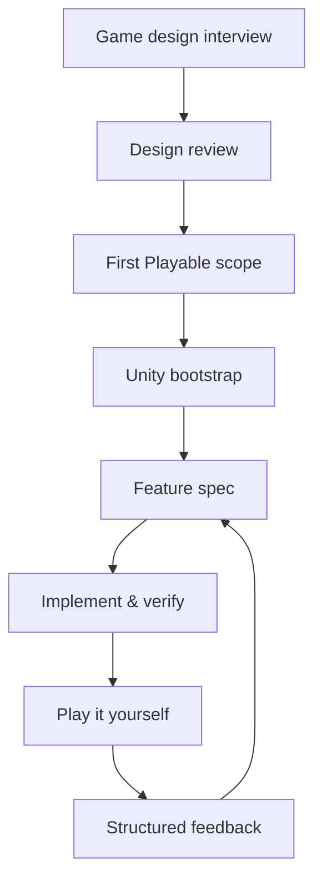

# FirstPlayable

**An AI-assisted workflow that turns game ideas into tested, playable Unity builds.**

FirstPlayable is a [Claude Code](https://claude.com/claude-code) plugin for solo
developers, small teams, and game jammers. It structures game development around
one idea: a feature is not done when the code compiles — it is done when you can
**play** it.

> 한국어 기획 문서: [docs/PROJECT_PLAN.ko.md](docs/PROJECT_PLAN.ko.md)

## The workflow



Every phase produces documents that the next phase treats as the source of
truth — so the AI implements what you decided, not what it guessed.

## Skills

| Command | Phase | Output |
|---|---|---|
| `/first-playable:design` | Design interview (3–5 questions at a time) | `Docs/Game/*` |
| `/first-playable:review-design` | Conflict & gap review, approval gate | `DESIGN_REVIEW.md` |
| `/first-playable:scope` | Smallest playable build definition + playtest hypotheses | `FIRST_PLAYABLE.md` |
| `/first-playable:bootstrap` | Safe Unity project setup (always dry-runs first) | folders, scenes, asmdefs, `CLAUDE.md` |
| `/first-playable:feature <name>` | Spec-first implementation with tests | `Docs/Features/*`, code, tests |
| `/first-playable:verify <name>` | Compile → tests → scene runtime check | verification report |
| `/first-playable:playtest` | Turns "it feels slippery" into a one-variable experiment | `Docs/Playtests/*` |

## Core principles

- **Playable first.** The pipeline ends at "a human played it and gave
  feedback", not at "tests pass".
- **Decisions are labeled.** Everything in the docs is `CONFIRMED`, `PROPOSED`,
  `TEMPORARY`, `UNRESOLVED`, or `EXCLUDED` — the AI's suggestions never
  silently become your decisions.
- **Evidence is labeled.** Verification reports distinguish `VERIFIED` (ran it)
  from `INFERRED` (read the code) from `MANUAL_REQUIRED` (only you can judge
  game feel).
- **Traceable.** Rule ID → feature spec → test name → verification report →
  playtest — every change traces back to a decision.
- **Safe by default.** No direct Unity YAML edits, no touching
  `Assets/ThirdParty`, no `.meta` deletion, dry-run before bootstrap.

## Requirements

- [Claude Code](https://claude.com/claude-code)
- Unity 6 (for the bootstrap/feature/verify phases; the design phases work anywhere)
- A Unity MCP server for scene/runtime verification — FirstPlayable checks the
  connection and guides setup, but does not bundle an MCP implementation

## Install

```bash
claude plugin marketplace add WhorideChicken/first-playable
```

```bash
claude plugin install first-playable
```

Then start with `/first-playable:design` and describe your game idea.

## Status & roadmap

Early development. Current version: **v0.2** — design workflow, Unity
reference docs (setup, testing, MCP, game feel), asmdef templates, and the
`unity-guard` safety hook.

| Version | Scope | Status |
|---|---|---|
| v0.1 | Design interview, review, scoping, templates | done |
| v0.2 | Unity references, asmdef templates, safety hooks | done |
| v0.3 | feature/verify validated end-to-end on a real Unity 6 project | next |
| v0.4 | Playtest structuring and spec feedback loop | planned |
| v1.0 | Primitive-only example project, Windows/macOS validation, release automation | planned |

See [CHANGELOG.md](CHANGELOG.md) for details and
[CONTRIBUTING.md](CONTRIBUTING.md) if you want to help.

## License

[MIT](LICENSE)
