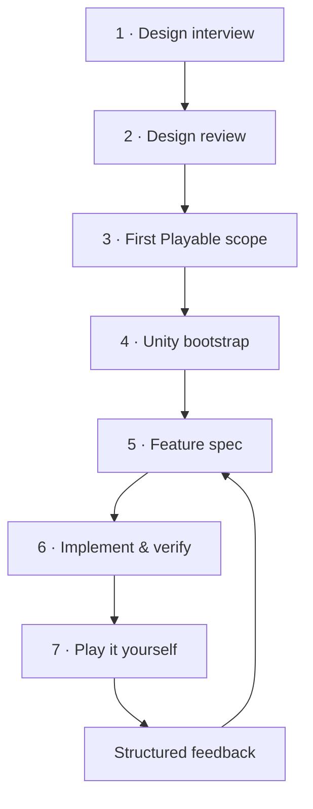
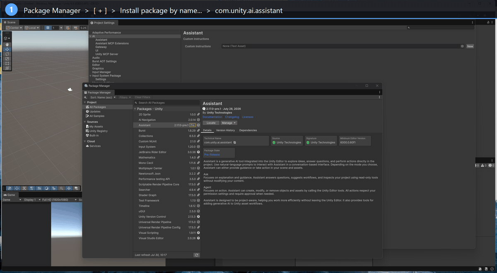

# FirstPlayable

**An AI-assisted workflow that turns game ideas into tested, playable Unity builds.**

[](CHANGELOG.md)
[](LICENSE)
[](https://claude.com/claude-code)

FirstPlayable is a [Claude Code](https://claude.com/claude-code) plugin for solo
developers, small teams, and game jammers, built around one idea:

> **A feature is not done when the code compiles.
> It is done when you can actually play it.**

AI coding tools are great at producing code that *looks* finished. FirstPlayable
adds the missing structure: your decisions get written down before
implementation, the AI's suggestions never silently become your decisions, and
nothing counts as "done" until it survived compilation, tests, a real scene
run — and your own hands on the keyboard.

> 🇰🇷 한국어 기획 문서는 [docs/PROJECT_PLAN.ko.md](docs/PROJECT_PLAN.ko.md)에 있습니다.

---

## Table of contents

- [How it works](#how-it-works)
- [Quick start](#quick-start)
  - [1. Install the plugin](#1-install-the-plugin)
  - [2. Connect Unity (optional, needed from Phase 4)](#2-connect-unity-optional-needed-from-phase-4)
  - [3. Start designing](#3-start-designing)
- [Keeping it updated](#keeping-it-updated)
- [The seven skills](#the-seven-skills)
- [Core principles](#core-principles)
- [Troubleshooting](#troubleshooting)
- [Roadmap](#roadmap)

---

## How it works



Each phase produces documents that the next phase treats as the source of
truth — so the AI implements what **you** decided, not what it guessed. Phases
1–3 are pure conversation and work anywhere. Phases 4–7 connect to a real
Unity project.

---

## Quick start

### What you need

| Requirement | Needed for | Notes |
|---|---|---|
| [Claude Code](https://claude.com/claude-code) | everything | CLI, desktop app, or IDE extension |
| Unity 6 | Phases 4–7 | design phases (1–3) work without Unity |
| Unity MCP server | Phases 4–7 | official path built into Unity — setup below |

### 1. Install the plugin

Run these two commands in any terminal:

```bash
claude plugin marketplace add WhorideChicken/first-playable
```

```bash
claude plugin install first-playable
```

**Check it worked:** run `claude plugin list` — you should see
`first-playable@first-playable · enabled`. Then open `claude` in any folder and
type `/first-playable` — seven skills should autocomplete.

This is a **user-level install**: it works in every project on your machine,
for your OS user account. No per-project setup needed.

### 2. Connect Unity (optional, needed from Phase 4)

Unity 6 ships an official MCP server as part of the AI Assistant package.
Three steps, all inside the Unity Editor:



1. **Install the Assistant package**
   `Window → Package Management → Package Manager` → click **`[+]`** (top-left) →
   **Install package by name…** → enter:

   ```text
   com.unity.ai.assistant
   ```

2. **Start the MCP server**
   `Edit → Project Settings → AI → Unity MCP Server` → press **Start**.
   Status should show a green **Running**.

3. **Connect Claude Code**
   Run `claude` in your Unity project folder. Within a few seconds,
   `claude-code` appears under **Connected Clients** — approve it once and
   it shows as **Accepted**. Done.

> **No Unity MCP? You can still use everything.** The `verify` skill switches
> to a guided manual protocol (it tells you exactly what to click in Unity and
> records your answers), and `bootstrap` generates one-shot Editor scripts
> instead of editing scenes directly. Community MCP servers also work — see
> [references/unity-mcp.md](references/unity-mcp.md).

### 3. Start designing

Open `claude` anywhere and describe your game:

```text
/first-playable:design
```

The AI interviews you (3–5 questions at a time), writes your answers into
design documents, and labels every statement as **your decision** or **its
suggestion**. From there, each phase tells you what command comes next.

---

## Keeping it updated

When a new version is released, run:

```bash
claude plugin marketplace update first-playable
```

```bash
claude plugin update first-playable@first-playable
```

> ⚠️ Two things people hit:
> - The update command needs the **full name** `first-playable@first-playable`
>   (plugin name @ marketplace name). The short name will say "not found".
> - **Restart any open Claude Code sessions** after updating — running
>   sessions keep the old version until restarted.

---

## The seven skills

| Command | What it does | You get |
|---|---|---|
| `/first-playable:design` | Interviews you about your game idea, 3–5 questions at a time | `Docs/Game/` — overview, core loop, rules with IDs, glossary |
| `/first-playable:review-design` | Hunts contradictions, missing decisions, scope creep — **before** any code | `DESIGN_REVIEW.md` with an explicit approval gate |
| `/first-playable:scope` | Cuts the game down to the smallest build that proves the fun | `FIRST_PLAYABLE.md`, dev order, falsifiable playtest hypotheses |
| `/first-playable:bootstrap` | Sets up folders, scenes, asmdefs, project rules — **always dry-runs first** | a safe, idempotent Unity project skeleton + `CLAUDE.md` |
| `/first-playable:feature <name>` | Writes a spec, waits for your approval, then implements with tests | `Docs/Features/<name>.md`, pure-logic code, EditMode/PlayMode tests |
| `/first-playable:verify <name>` | Compile → console → tests → real scene run, honestly labeled | a verification report separating facts from judgment calls |
| `/first-playable:playtest` | Turns "it feels slippery" into hypotheses and a one-variable experiment | `Docs/Playtests/` records that feed back into specs |

Behind the skills: three agents (`game-designer`, plus read-only
`unity-architect` and `unity-qa` reviewers), deep-dive reference docs
([Unity setup](references/unity-setup.md) ·
[testing](references/unity-testing.md) ·
[MCP](references/unity-mcp.md) ·
[game feel](references/game-feel.md)), and ready-made
[templates](templates/) including six asmdefs with an engine-free `Game.Core`.

### The safety hook

Installing the plugin also activates `unity-guard`, which catches four
classic AI-assisted-Unity accidents **before they happen** and asks you first:

- **editing a script while Unity is in play mode** — this deadlocks the whole
  session (Unity defers the recompile, MCP locks up, and nothing can exit play
  mode but your own hand on the Stop button)
- editing `.unity` / `.prefab` / `.asset` files as raw text (corrupts scenes)
- modifying anything under `Assets/ThirdParty` (lost on update, license risk)
- writing or deleting `.meta` files (silently breaks asset references)

It's ask-not-block (you can always override) and stays silent outside Unity
projects, so it won't bother your other work.

---

## Core principles

**Decisions are labeled.** Every statement in every document carries a status:

| Label | Meaning |
|---|---|
| `CONFIRMED` | you decided this |
| `PROPOSED` | the AI suggested it — not yet your decision |
| `TEMPORARY` | placeholder value, good enough for a prototype |
| `UNRESOLVED` | needs a decision before implementation |
| `EXCLUDED` | explicitly decided NOT to build |

**Evidence is labeled.** Verification reports distinguish `VERIFIED` (actually
ran it) from `INFERRED` (read the code) from `MANUAL_REQUIRED` (only a human
playing can judge). The AI never gets to claim game feel works.

**Everything traces.** Rule ID → feature spec → test name → verification
report → playtest record. When a rule changes, you can see exactly which
features and tests are affected.

**Safe by default.** Approval gates before implementation, dry-runs before
writes, the unity-guard hook, and no direct Unity YAML edits — ever.

### Why these rules exist

They aren't theoretical. v0.3.0 was written from a real Unity 6 project run,
where six of eight incidents were *passing checks with wrong conclusions* —
including one measurement that concluded the exact opposite of what a human
found in 30 seconds of play.

📋 **[Read the field report](examples/field-report-unity-6.md)** — the
incidents, the costs, and what each one changed.

---

## Troubleshooting

<details>
<summary><code>claude plugin list</code> shows nothing after installing</summary>

The output can be long — scroll: your plugin is likely there. If genuinely
missing, re-run the install and check `~/.claude/settings.json` contains
`"first-playable@first-playable": true` under `enabledPlugins`.
</details>

<details>
<summary>Installed version is older than the repo</summary>

The marketplace clone is cached. Run the two commands in
[Keeping it updated](#keeping-it-updated) — the marketplace update refreshes
the clone, the plugin update installs the new version. Then restart sessions.
</details>

<details>
<summary><code>claude plugin update first-playable</code> says "not found"</summary>

Use the full name: `claude plugin update first-playable@first-playable`.
</details>

<details>
<summary>Unity MCP Server page missing in Project Settings</summary>

The `com.unity.ai.assistant` package isn't installed (or still compiling).
Install it via Package Manager → `[+]` → *Install package by name…* — note
Unity 6.5 moved the menu to `Window → Package Management → Package Manager`.
</details>

<details>
<summary>claude-code doesn't appear under Connected Clients</summary>

Make sure the server Status is **Running** (press Start), then launch `claude`
from the Unity **project folder**. First connection needs a one-time approval
in the Unity settings page. If it still fails, check
`Show Debug Logs` on the same page.
</details>

---

## Roadmap

| Version | Scope | Status |
|---|---|---|
| v0.1 | Design interview, review, scoping, templates | ✅ done |
| v0.2 | Unity references, asmdef templates, unity-guard hook, official Unity MCP setup docs | ✅ done |
| v0.3 | Hardening from a real Unity 6 project run: play-mode deadlock guard, evidence rules for instrumented measurements, vacuous-test detection | ✅ done |
| v0.4 | Playtest structuring and spec feedback loop | 🔜 next |
| v1.0 | Primitive-only example project, Windows/macOS validation, release automation | planned |

Details in [CHANGELOG.md](CHANGELOG.md). Want to help? See
[CONTRIBUTING.md](CONTRIBUTING.md) — real-world usage reports are the most
valuable contribution right now.

## License

[MIT](LICENSE)
