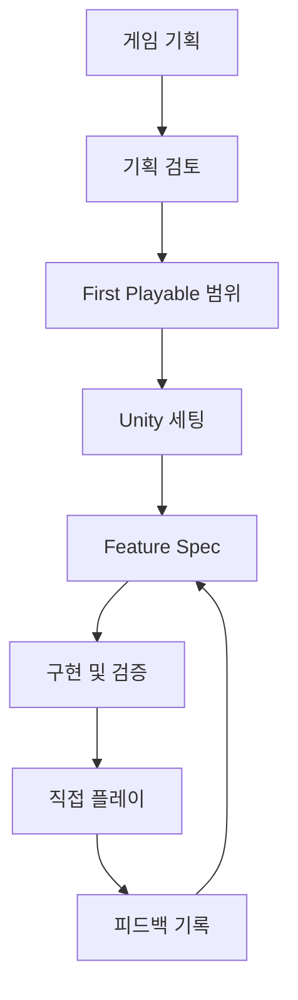

# FirstPlayable

## 1. 프로젝트 개요

| 항목 | 내용 |
|---|---|
| 이름 | FirstPlayable |
| 형태 | Claude Code Plugin |
| 최초 지원 엔진 | Unity 6 |
| 연동 | Unity MCP |
| 배포 | GitHub 오픈소스 |
| 라이선스 | MIT |
| 대상 | 1인 개발자, 소규모 팀, 게임잼·해커톤 참가자 |

FirstPlayable은 게임 아이디어를 대화형 기획 문서로 구체화하고, 확정된 기획을 Unity 프로젝트 세팅·기능 명세·구현·검증·플레이테스트로 연결하는 AI 게임 개발 워크플로우다.

---

## 2. 목표

- 구현 전에 게임의 핵심 재미와 규칙을 확정한다.
- 확정된 내용과 AI의 제안, 임시값, 미정 사항을 분리한다.
- 전체 게임이 아닌 가장 작은 플레이 가능 범위를 먼저 만든다.
- 기획 문서와 기능 명세를 실제 코드와 테스트의 기준으로 사용한다.
- Unity에서 컴파일, 테스트, Scene 실행까지 검증한다.
- 사람이 직접 플레이한 결과를 다음 개발에 반영한다.
- 모든 주요 결정과 변경 이유를 문서로 남긴다.

---

## 3. 기본 원칙

### 3.1 Playable First

기능 완료는 코드 작성이나 컴파일 성공이 아니라 실제 플레이 가능한 상태를 의미한다.

```text
기획
→ 명세
→ 구현
→ 컴파일
→ 자동 테스트
→ Unity 실행 검증
→ 직접 플레이
→ 피드백 반영
```

### 3.2 정보 상태

| 상태 | 의미 |
|---|---|
| `CONFIRMED` | 사용자가 확정한 내용 |
| `PROPOSED` | AI가 제안했지만 승인되지 않은 내용 |
| `TEMPORARY` | 프로토타입을 위한 임시값 |
| `UNRESOLVED` | 추가 결정이 필요한 내용 |
| `EXCLUDED` | 구현하지 않기로 확정한 내용 |

### 3.3 검증 상태

| 상태 | 의미 |
|---|---|
| `VERIFIED` | 테스트 또는 실제 실행으로 확인 |
| `INFERRED` | 코드와 설정을 근거로 추론 |
| `UNVERIFIED` | 아직 확인하지 못함 |
| `MANUAL_REQUIRED` | 사람의 직접 판단이 필요 |

### 3.4 변경 원칙

- 변경 전에 대상과 범위를 보여준다.
- 기존 파일은 동의 없이 덮어쓰지 않는다.
- 반복 실행해도 동일한 결과를 유지한다.
- Scene과 Prefab은 Unity MCP 또는 Editor API로 수정한다.
- Unity YAML을 직접 수정하지 않는다.
- `Assets/ThirdParty` 원본을 수정하지 않는다.
- `.meta` 파일을 삭제하거나 재생성하지 않는다.
- 패키지를 임의로 제거하지 않는다.

---

## 4. 전체 워크플로우



---

## 5. Phase 1: 게임 기획

명령:

```text
/first-playable:design
```

AI는 한 번에 3~5개의 질문을 제시하고 사용자의 답을 문서에 누적한다.

### 질문 순서

1. 플레이어는 어떤 존재인가
2. 플레이어가 가장 자주 반복하는 행동은 무엇인가
3. 게임의 성공과 실패는 어떻게 결정되는가
4. 플레이어는 어떤 선택과 판단을 하는가
5. 한 판은 어떻게 시작하고 끝나는가
6. 반복 플레이에서 무엇이 달라지는가
7. 타깃 플랫폼과 입력 방식은 무엇인가
8. 반드시 포함하거나 제외할 기능은 무엇인가

### 산출물

```text
Docs/Game/
├─ GAME_OVERVIEW.md
├─ CORE_LOOP.md
├─ GAME_RULES.md
├─ PLAYER_EXPERIENCE.md
├─ GLOSSARY.md
└─ OPEN_QUESTIONS.md
```

### GAME_OVERVIEW.md

- 게임 한 줄 설명
- 장르
- 플레이어 역할
- 핵심 재미
- 타깃 플랫폼
- 예상 플레이 시간
- 포함 범위
- 제외 범위

### CORE_LOOP.md

```text
상황 인지
→ 행동 선택
→ 실행
→ 결과 확인
→ 다음 선택
```

각 단계에는 다음을 기록한다.

- 플레이어 입력
- 게임 반응
- 위험과 보상
- 다음 행동으로 이어지는 이유

### GAME_RULES.md

각 규칙은 고유 ID를 가진다.

```markdown
## MOVE-001

- 상태: CONFIRMED
- 조건: 플레이어가 지상에 있고 이동 입력이 존재한다.
- 처리: 카메라 기준 입력 방향으로 이동한다.
- 결과: 캐릭터의 위치와 방향이 변경된다.
- 예외: 넉백 상태에서는 입력 이동을 적용하지 않는다.
```

### PLAYER_EXPERIENCE.md

- 플레이어가 처음 이해해야 할 것
- 조작감의 목표
- 성공했을 때의 감정
- 실패 원인의 전달 방식
- 다시 시도하게 만드는 요소
- 카메라와 시야 원칙
- 피드백 우선순위

---

## 6. Phase 2: 기획 검토

명령:

```text
/first-playable:review-design
```

검토 항목:

- 핵심 루프가 반복 가능한가
- 성공과 실패 조건이 명확한가
- 플레이어의 선택이 존재하는가
- 규칙끼리 충돌하지 않는가
- 핵심 재미와 무관한 기능이 포함되지 않았는가
- 플레이로 검증할 수 있는 형태인가
- 중요한 미정 사항이 구현 단계로 넘어가고 있지 않은가
- 제외 범위가 명시됐는가

검토 결과:

```markdown
# Design Review

## Passed

- 검토를 통과한 항목

## Conflicts

- 충돌하는 규칙

## Missing Decisions

- 구현 전에 결정해야 할 사항

## Scope Risks

- 범위를 키울 가능성이 있는 기능

## Approval

Draft | Approved
```

`Approved` 전에는 Unity 프로젝트 구현을 시작하지 않는다.

---

## 7. Phase 3: First Playable 범위 확정

명령:

```text
/first-playable:scope
```

First Playable은 전체 콘텐츠가 아니라 핵심 재미를 직접 조작하고 검증할 수 있는 최소 빌드다.

### 포함 기준

- 플레이어 입력
- 핵심 이동 또는 핵심 행동
- 최소 상호작용 대상
- 성공 조건
- 실패 조건
- 재시작
- 필요한 최소 UI와 피드백

### 제외 기준

- 핵심 재미 검증과 무관한 콘텐츠
- 최종 그래픽 품질
- 다수의 맵과 캐릭터
- 장기 성장 시스템
- 상점과 수익화
- 라이브 운영 기능
- 확장용 추상화

### 산출물

```text
Docs/Design/
├─ FIRST_PLAYABLE.md
├─ DEVELOPMENT_ORDER.md
└─ PLAYTEST_HYPOTHESES.md
```

### FIRST_PLAYABLE.md

```markdown
# First Playable

## 검증할 핵심 재미

## 플레이 시작 상태

## 플레이 종료 상태

## 포함 기능

## 제외 기능

## 성공 조건

## 실패 조건

## 완료 조건

## 수동 검증 항목
```

### PLAYTEST_HYPOTHESES.md

```markdown
## HYP-001

### 가설

플레이어는 물리 기반 밀치기의 방향과 강도를 조절하는 과정에서 재미를 느낀다.

### 검증 방법

- 실패 후 다시 시도하는가
- 다음 시도에서 다른 전략을 사용하는가
- 결과를 자신의 조작과 연결해서 이해하는가

### 실패 판단

- 결과가 무작위라고 느낀다.
- 조작보다 운이 중요하다고 평가한다.
- 첫 실패 후 재도전하지 않는다.
```

---

## 8. Phase 4: Unity 프로젝트 세팅

명령:

```text
/first-playable:bootstrap
```

### 사전 검사

- Unity 프로젝트 여부
- Unity 버전
- 렌더 파이프라인
- Input System
- Test Framework
- Cinemachine 사용 여부
- Git 저장소와 `.gitignore`
- Visible Meta Files
- Force Text
- Unity MCP 연결
- 기존 Scene과 asmdef

### 프로젝트 모드

| 모드 | 용도 | 구조 |
|---|---|---|
| Prototype | 게임잼, 짧은 검증 | 최소 폴더와 asmdef |
| Standard | 1인·소규모 프로젝트 | Core, Gameplay, Presentation, Tests 분리 |
| Modular | 장기 운영과 팀 개발 | 기능 단위 모듈 분리 |

기본값은 `Standard`다.

### 기본 폴더 구조

```text
Assets/
├─ _Game/
│  ├─ Art/
│  ├─ Audio/
│  ├─ Configs/
│  ├─ Prefabs/
│  ├─ Scenes/
│  │  ├─ Bootstrap/
│  │  ├─ Gameplay/
│  │  └─ Test/
│  ├─ Scripts/
│  │  ├─ Core/
│  │  ├─ Gameplay/
│  │  ├─ Presentation/
│  │  ├─ Infrastructure/
│  │  └─ Editor/
│  └─ Tests/
│     ├─ EditMode/
│     └─ PlayMode/
└─ ThirdParty/
```

### 기본 Scene

| Scene | 역할 |
|---|---|
| Bootstrap | 게임 초기화와 공통 서비스 구성 |
| FirstPlayable | 핵심 루프를 플레이하는 Scene |
| Sandbox | 기능 단독 실험 |
| Test | 자동·수동 검증 |

### 생성 파일

```text
CLAUDE.md
Docs/PROJECT_STATUS.md
Assets/_Game/
Assets/ThirdParty/
Assets/_Game/Tests/EditMode/
Assets/_Game/Tests/PlayMode/
```

### CLAUDE.md 필수 규칙

```markdown
# Project Rules

## Source of Truth

1. Docs/Game
2. Docs/Design/FIRST_PLAYABLE.md
3. Docs/Features
4. Docs/Decisions
5. Existing code

## Unity Rules

- Scene과 Prefab은 Unity MCP 또는 Editor API로 수정한다.
- Unity YAML을 직접 수정하지 않는다.
- Assets/ThirdParty 원본을 수정하지 않는다.
- 기존 asmdef 경계를 확인한 후 코드를 추가한다.
- 모든 기능은 Feature Spec의 범위와 완료 조건을 따른다.

## Verification

- 컴파일 성공
- 신규 Console Error 0건
- 관련 EditMode 테스트 통과
- 관련 PlayMode 테스트 통과
- 대상 Scene 실행 확인
- 사람의 수동 검증 항목 분리
```

---

## 9. Phase 5: 기능 명세와 구현

명령:

```text
/first-playable:feature player-movement
```

기능을 바로 구현하지 않고 먼저 명세를 작성한다.

### 기능 개발 순서

```text
기획 문서 확인
→ 관련 코드와 패키지 조사
→ Feature Spec 작성
→ 사용자 승인
→ 순수 로직 구현
→ EditMode 테스트
→ Unity 연동
→ PlayMode 테스트
→ Scene 실행 검증
```

### Feature Spec 위치

```text
Docs/Features/
├─ PLAYER_MOVEMENT.md
├─ CAMERA.md
├─ CORE_ACTION.md
├─ INTERACTION_TARGET.md
└─ RUN_FLOW.md
```

### Feature Spec 템플릿

```markdown
# Feature: Player Movement

## Status

Draft | Approved | Implementing | Verified

## 목적

## 플레이어 관점

## 참조 규칙

- MOVE-001

## 포함 범위

## 제외 범위

## 동작 규칙

## 초기 조정 값

| 항목 | 값 | 상태 |
|---|---:|---|
| 이동 속도 | 5 | TEMPORARY |
| 회전 시간 | 0.1초 | TEMPORARY |

## 완료 조건

## EditMode 테스트

## PlayMode 테스트

## 수동 플레이 검증

## 미정 사항
```

### 구현 순서

```text
입력
→ 이동
→ 카메라
→ 핵심 행동
→ 상호작용 대상
→ 성공·실패
→ 재시작
```

한 번의 기능 개발에서는 승인된 Feature Spec 범위만 구현한다.

---

## 10. Phase 6: Unity 검증

명령:

```text
/first-playable:verify player-movement
```

### 검증 순서

1. Unity MCP 연결 확인
2. Unity 컴파일 완료 대기
3. 신규 Console Error 확인
4. 관련 Warning 확인
5. EditMode 테스트 실행
6. PlayMode 테스트 실행
7. 대상 Scene 열기
8. Play Mode 진입
9. 핵심 오브젝트와 상태 확인
10. 자동 검증 불가능한 항목 분리

### 검증 보고서

```markdown
# Verification Report

## Scope

## Compilation

- Status:
- New errors:
- New warnings:

## EditMode Tests

- Passed:
- Failed:

## PlayMode Tests

- Passed:
- Failed:

## Runtime Verification

- 확인한 Scene
- 확인한 오브젝트
- 확인한 상태 변화

## Manual Verification Required

- 조작 반응성
- 카메라 감각
- 피드백 전달력

## Remaining Risks
```

AI가 확인한 사실과 사람이 판단해야 할 항목을 분리한다.

---

## 11. Phase 7: 플레이테스트 기록

명령:

```text
/first-playable:playtest
```

사용자의 자연어 피드백을 관찰, 가설, 실험으로 구조화한다.

### 입력 예시

```text
반대 방향으로 틀 때 캐릭터가 오래 미끄러지는 것 같아.
이동 속도는 괜찮고 카메라는 조금 늦게 따라오는 느낌이야.
```

### 기록 형식

```markdown
# Playtest

## Observation

- 반대 방향 입력 시 정지 거리가 길게 느껴진다.
- 카메라 추적 지연이 체감된다.
- 최고 이동 속도는 적절하다.

## Hypotheses

- 감속 시간이 길 수 있다.
- 회전 보간 시간이 길 수 있다.
- 카메라 Damping이 높을 수 있다.

## Next Experiment

1. 최고 속도는 유지한다.
2. 감속 시간만 변경한다.
3. 이동감을 확인한 뒤 카메라를 별도로 조정한다.

## Success Criteria

- 반대 방향 입력에 빠르게 반응한다.
- 이동이 끊기는 느낌은 발생하지 않는다.
```

### 기록 위치

```text
Docs/Playtests/
└─ YYYY-MM-DD_FEATURE_NAME.md
```

조정 결과가 확정되면 관련 Feature Spec의 임시값과 변경 이유를 갱신한다.

---

## 12. 결정 기록

중요한 기획·기술 결정은 별도 문서로 남긴다.

```text
Docs/Decisions/
├─ 0001-use-urp.md
├─ 0002-character-controller.md
└─ 0003-no-root-motion.md
```

### 템플릿

```markdown
# 0003: 이동에 Root Motion을 사용하지 않는다

## 상태

Proposed | Accepted | Superseded

## 배경

## 결정

## 이유

## 영향
```

---

## 13. Plugin 구성

```text
first-playable/
├─ .claude-plugin/
│  └─ plugin.json
├─ skills/
│  ├─ design/
│  │  └─ SKILL.md
│  ├─ review-design/
│  │  └─ SKILL.md
│  ├─ scope/
│  │  └─ SKILL.md
│  ├─ bootstrap/
│  │  └─ SKILL.md
│  ├─ feature/
│  │  └─ SKILL.md
│  ├─ verify/
│  │  └─ SKILL.md
│  └─ playtest/
│     └─ SKILL.md
├─ agents/
│  ├─ game-designer.md
│  ├─ unity-architect.md
│  └─ unity-qa.md
├─ hooks/
├─ scripts/
├─ templates/
│  ├─ game/
│  ├─ design/
│  ├─ features/
│  ├─ decisions/
│  └─ reports/
├─ examples/
├─ README.md
├─ LICENSE
└─ CHANGELOG.md
```

---

## 14. Skills

| Skill | 역할 | 주요 산출물 |
|---|---|---|
| `design` | 게임 기획 인터뷰 | `Docs/Game/*` |
| `review-design` | 기획 충돌과 누락 검토 | `DESIGN_REVIEW.md` |
| `scope` | First Playable 범위 확정 | `FIRST_PLAYABLE.md` |
| `bootstrap` | Unity 프로젝트 구성 | 폴더, Scene, asmdef, `CLAUDE.md` |
| `feature` | 기능 명세와 구현 | `Docs/Features/*`, 코드, 테스트 |
| `verify` | Unity 실행 검증 | 검증 보고서 |
| `playtest` | 플레이 피드백 구조화 | `Docs/Playtests/*` |

---

## 15. Agents

| Agent | 역할 | 수정 범위 |
|---|---|---|
| Game Designer | 질문, 룰 정리, 범위 검토 | 기획 문서 |
| Unity Architect | 프로젝트 구조와 기술 선택 검토 | 기본 읽기 전용 |
| Unity QA | 완료 조건, 테스트, 실행 결과 검토 | 읽기 전용 |

검토 Agent는 문제를 직접 수정하지 않고 결과와 위험을 보고한다.

---

## 16. Hooks

Hooks는 자동 실행보다 위험 변경 감지에 사용한다.

- Scene·Prefab YAML 직접 수정 경고
- `Assets/ThirdParty` 수정 경고
- `.meta` 삭제 경고
- 검증 없이 기능을 완료 처리할 때 경고

Unity 컴파일과 테스트는 명시적인 Skill 실행으로 처리한다.

---

## 17. 문서와 구현 추적

```text
GAME_RULES: MOVE-001
→ PLAYER_MOVEMENT Feature Spec
→ EditMode/PlayMode 테스트
→ Verification Report
→ Playtest Report
→ Feature Spec 조정 이력
```

각 단계는 이전 단계의 ID를 참조한다.

### 추적 규칙

- 게임 규칙은 고유 ID를 가진다.
- Feature Spec은 관련 규칙 ID를 참조한다.
- 테스트 이름 또는 설명에 규칙 ID를 포함한다.
- 검증 보고서에는 통과한 규칙 ID를 기록한다.
- 플레이테스트 결과는 관련 Feature Spec을 참조한다.
- 규칙 변경 시 영향을 받는 기능과 테스트를 표시한다.

---

## 18. MVP 범위

### v0.1: 기획

- `design`
- `review-design`
- `scope`
- 기획 문서 템플릿
- 상태 분리
- 기획 충돌 검사

### v0.2: Unity 세팅

- `bootstrap`
- 프로젝트 검사
- 폴더와 asmdef 생성
- 기본 Scene 생성
- `CLAUDE.md` 생성
- Git과 Unity 설정 검사
- Unity MCP 연결 검사

### v0.3: 기능 개발

- `feature`
- `verify`
- Feature Spec
- EditMode/PlayMode 테스트
- Unity 실행 검증
- 검증 보고서

### v0.4: 플레이테스트

- `playtest`
- 가설 기반 실험
- 변경 이유 기록
- Feature Spec 갱신

### v1.0

- Unity 6 지원 범위 확정
- Windows와 macOS 검증
- Primitive 기반 예제 프로젝트
- 실제 게임 프로젝트 적용 사례
- 설치·업데이트·제거 문서
- 테스트와 릴리스 자동화

---

## 19. MVP 완료 조건

다음 시나리오가 처음부터 끝까지 동작해야 한다.

1. 사용자가 게임 아이디어를 입력한다.
2. 기획 질문을 통해 핵심 루프와 규칙이 정리된다.
3. 기획 검토 후 문서가 승인된다.
4. First Playable 범위와 플레이테스트 가설이 생성된다.
5. Unity 프로젝트가 안전하게 구성된다.
6. 첫 번째 Feature Spec이 작성되고 승인된다.
7. 기능 코드와 테스트가 구현된다.
8. Unity에서 컴파일과 테스트가 실행된다.
9. 대상 Scene에서 실제 동작이 검증된다.
10. 사용자의 플레이 피드백이 실험안으로 정리된다.
11. 확정된 변경이 Feature Spec에 반영된다.

---

## 20. 초기 개발 순서

```text
1. Plugin 기본 구조
2. 문서 템플릿
3. design Skill
4. review-design Skill
5. scope Skill
6. bootstrap dry-run
7. bootstrap 실제 적용
8. feature Skill
9. verify Skill
10. playtest Skill
11. Primitive 예제 프로젝트
12. 실제 게임 프로젝트 검증
```

FirstPlayable 자체 개발에도 동일한 원칙을 적용한다. 각 버전은 문서 생성만 시연하는 것이 아니라 Unity 프로젝트에서 실제 플레이 가능한 결과까지 검증한다.

---

## 21. GitHub Public 저장소 설정

### 저장소 생성값

| 항목 | 설정값 |
|---|---|
| Repository name | `first-playable` |
| Description | `An AI-assisted workflow that turns game ideas into tested, playable Unity builds.` |
| Visibility | `Public` |
| Initialize with README | 활성화 |
| Add .gitignore | `None` |
| License | `MIT License` |

Owner는 개인 GitHub 계정 또는 프로젝트를 계속 관리할 조직 계정을 사용한다.

### Topics

```text
unity
unity3d
game-development
ai-assisted-development
claude-code
claude-plugin
game-design
game-prototyping
vertical-slice
developer-tools
```

### 기본 저장소 설정

| 항목 | 설정 |
|---|---|
| Default branch | `main` |
| Issues | 활성화 |
| Discussions | 활성화 |
| Projects | 초기 비활성화 |
| Wiki | 비활성화 |
| Sponsorships | 초기 비활성화 |
| Preserve this repository | 비활성화 |
| Template repository | 비활성화 |
| Allow merge commits | 비활성화 |
| Allow squash merging | 활성화 |
| Allow rebase merging | 비활성화 |
| Automatically delete head branches | 활성화 |
| Web commit sign-off | 선택 |

### 초기 저장소 구조

```text
first-playable/
├─ .claude-plugin/
│  └─ plugin.json
├─ skills/
├─ agents/
├─ hooks/
├─ scripts/
├─ templates/
├─ examples/
├─ docs/
├─ .gitignore
├─ CONTRIBUTING.md
├─ LICENSE
├─ README.md
└─ SECURITY.md
```

이 저장소는 Unity 게임 프로젝트가 아니라 Claude Code Plugin 저장소다. 따라서 GitHub 생성 화면에서 Unity용 `.gitignore`를 선택하지 않고, 실제 Plugin 파일 구성에 맞는 `.gitignore`를 별도로 작성한다.

### GitHub About 및 릴리스

| 항목 | 설정 |
|---|---|
| Website | 초기 공란 |
| Releases | 활성화 |
| Packages | 사용하지 않으면 공란 |
| 첫 릴리스 태그 | `v0.1.0` |
| 첫 릴리스 제목 | `FirstPlayable v0.1.0 — Game Design Workflow` |

### 공개 저장소 제외 항목

- Unity Asset Store 에셋
- 재배포 권한이 없는 폰트, 이미지, 음원, 3D 모델
- 다른 Plugin이나 Skill의 소스 복사본
- API Key, 토큰, MCP 인증 정보
- 개인 경로와 로컬 환경 설정
- Unity `Library`, `Temp`, `Logs`, `Obj` 디렉터리
- 빌드 결과물과 불필요한 대용량 바이너리

예제 Unity 프로젝트가 필요하면 외부 에셋 없이 Primitive만 사용한다.

```text
Capsule = Player
Cube = Enemy
Plane = Ground
Sphere = Pickup
```

Unity MCP 구현체는 저장소에 포함하지 않는다. FirstPlayable은 연결 여부를 검사하고 공식 설치 방법만 안내한다.
